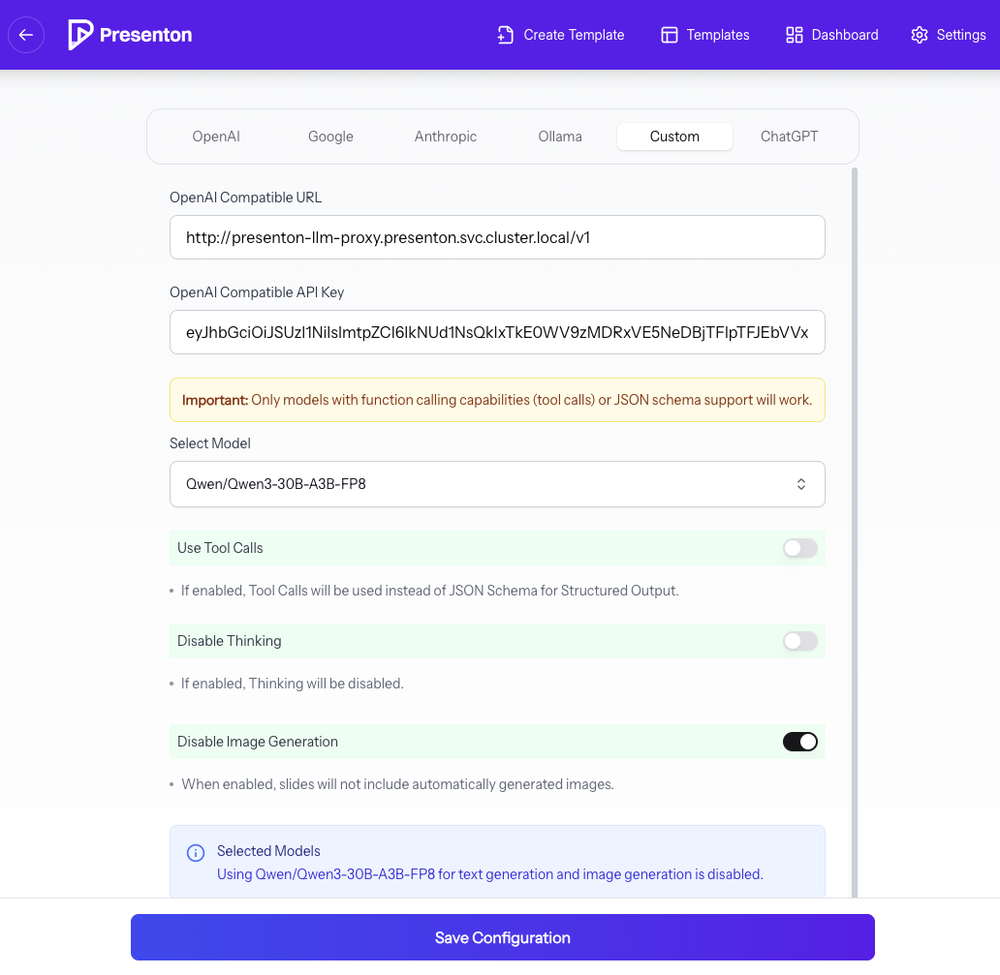
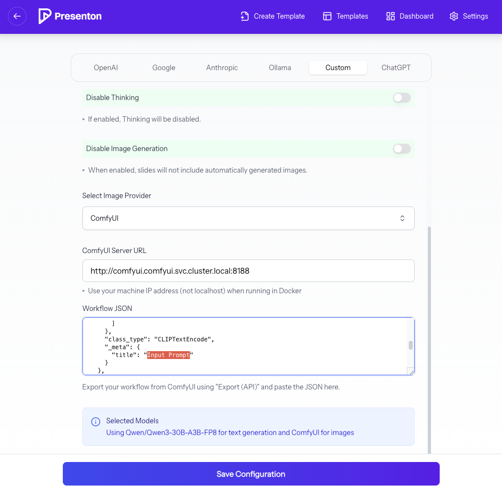

# Presenton in PCAI
Presenton is an Open-Source AI Presentation Generator and API (Gamma, Beautiful AI, Decktopus Alternative). [github](https://github.com/presenton/presenton)

## Helm chart
- Add PCAI's virtual service section to Values.yaml.
```yaml
ezua:
  virtualService:
    endpoint: "presenton.${DOMAIN_NAME}"
    istioGateway: "istio-system/ezaf-gateway"
```
- add HPE EzUA label and Resources for pod monitoring
```yaml
podLabels:
  hpe-ezua/app: presenton
  hpe-ezua/type: vendor-service  
...
resources: 
  limits:
    cpu: 8000m
    memory: 8192Mi
  requests:
    cpu: 100m
    memory: 128Mi
```

- Add virtualservice ( templates/ezua/virtualService.yaml )
```yaml
apiVersion: networking.istio.io/v1alpha3
kind: VirtualService
metadata:
  name: {{ include "presenton.name" . }}
spec:
  gateways:
    - {{ .Values.ezua.virtualService.istioGateway | required ".Values.ezua.virtualService.istioGateway is required !\n" }}
  hosts:
    - {{ .Values.ezua.virtualService.endpoint | required ".Values.ezua.virtualService.endpoint is required !\n" }}
  http:
    - match:
        - uri:
            prefix: /
      rewrite:
        uri: /
      route:
        - destination:
            # Insert target service name here
            host: {{ include "presenton.fullname" . }}.{{ .Release.Namespace }}.svc.cluster.local
            port:
              # Insert target service port number here
              number: {{ .Values.service.port }}
```

## Persistence via PVC
To save internal SQLite and generated presentations presistently, Please Configure following sections properly. It will create PVC for those artifacts
- Configure storageClass properly. ( Dev Kit: nfs-csi | S,M,L: gl4f-filesystem )
```yaml
persistence:
  # -- Enable persistence using PVC for SQLite
  enabled: True
  # -- Storage class of the Presenton PVC
  storageClass: "nfs-csi" # gl4f-filesystem for PCAI
  # -- If using multiple replicas, you must update accessModes to ReadWriteMany
  accessModes:
    - ReadWriteMany
  # -- Size of the presenton PVC
  size: 8Gi
  # -- MountPath of the presenton PVC, Do not update mountPath.
  mountPath: /app_data
  # -- Use existingClaim if you want to re-use an existing Presenton PVC instead of creating a new one
  existingClaim: ""
  # -- Additional annotations to add to the PVC
  annotations: {}
```
## llmProxy service
Currently ( Presenton 0.6.0-beta ), Presenton supports OpenAI-compatible API - [link](https://docs.presenton.ai/configurations/using-custom-llm#-example-run-presenton-with-a-custom-llm). **However, successful presentation generation critically depends on the model producing strictly structured output.** If the model’s response does not precisely align with Presenton’s internal schema and logic:
- Presentation creation may fail, and
- Troubleshooting and root-cause analysis can be difficult and time‑consuming. 

To address this, this Helm chart deploys **presenton-llm-proxy** deployment ([reference](https://github.com/presenton/presenton/issues/383)) between presenton <-> Upstream OpenAI compatible Server. Since This [issue](https://github.com/orgs/presenton/projects/2?pane=issue&itemId=161087892&issue=presenton%7Cpresenton%7C383) is on the roadmap of presenton, This will be resolved in the future release. 

### What the llmProxy Does
The presenton-llm-proxy service acts as an intermediary layer with the following responsibilities:
1. Extract response_format from requests and Convert it into the system prompt
2. Validating LLM responses to ensure JSON format and Forward only valdated responses back to presenton
3. Logging requests body to simplify debugging and failure analysis.

> *please update **Values.llmProxy.env.upstreamLlmUrl** for your Upstream OpenAI-compatible API server. - i.e. MLIS endpoints in PCAI The URL must include **/v1**.*

```yaml
llmProxy:
  enabled: true
  image:
    repository: geuntakroh/presenton-llm-proxy
    tag: "v0.0.1"
    pullPolicy: IfNotPresent
  env:
    upstreamLlmUrl: "" # Mandatory for llmProxy service, include /v1 in the url
  service:
    type: ClusterIP
    port: 80
  livenessProbe:
    httpGet:
      path: /health
      port: http
  readinessProbe:
    httpGet:
      path: /health
      port: http    
```
### Configure llmProxy
Put the presenton-llm-proxy service's K8s FQDN and Model's Token. Exact Values can be differ from attached image.
> Model should support Tool Calling or Structured output for JSON schema. For Qwen3 series add following arguments in MLIS Packaged Model's advanced section for vLLM:
> **--enable-auto-tool-choice --tool-call-parser hermes --reasoning-parser qwen3**




## Image Generation
Presenton supports various Image generation API includes ComfyUI. User can leverage ComfyUI for On-premise environment. Once deploy the ComfyUI in PCAI, Please follow the presenton's manual
- https://docs.presenton.ai/configurations/comfyui-integration

